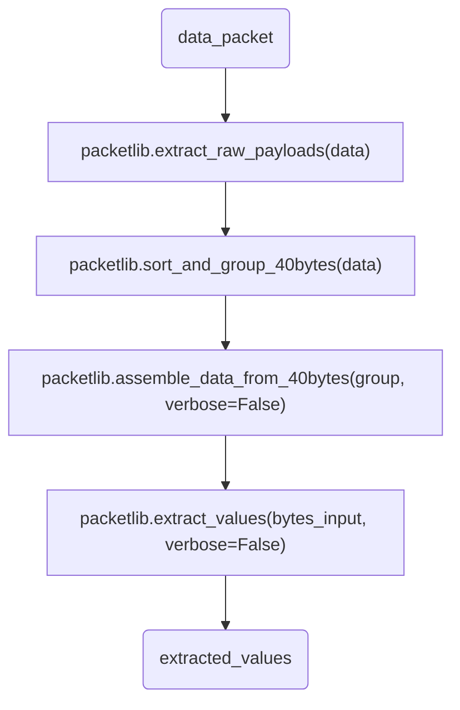

# H2GCROC Automatic Scripts

This repository contains the scripts (based on original scripts from N. Novitzky) used to automate the testing of the KCU-H2GCROC system. All scripts are written in Python, and require the `packetlib` library to be installed ([link](https://gitlab.cern.ch/sjia/h2gcroc_packet_lib.git)).

## Before running the scripts

Make sure that the `packetlib` library is installed. If not, install it using the following command:

```bash
git clone ssh://git@gitlab.cern.ch:7999/sjia/h2gcroc_packet_lib.git
cd h2gcroc_packet_lib
pip install .
```

All the generated data will be stored in the `dump` folder. Before running the scripts, make sure that the `dump` folder exists in the same directory as the scripts.

```bash
mkdir dump
```

## Common settings

In the `common_settings.json` file, you can find the following settings:

```json
"udp": {
    "h2gcroc_ip": "10.1.2.208",
    "pc_ip": "10.1.2.207",
    "h2gcroc_port": 11000,
    "pc_port": 11000
}
```

Modify the IP addresses and ports according to your setup. It will be used in all the scripts.

## 001_IODelay.py

You can run the script using the following command:

```bash
python 001_IODelay.py
```

### Structure

After configurating the registers via I2C, the script will run though all the possible bitslip values (0 to 511) and read the IO values. Then it will go through all the possible working IODELAY values and do a fine scan to find the best value. The script will then set the IODELAY value to the best value found and save the configuration to a file. 

### Verbosity

There are four verbosity options available:
- i2c_setting_verbose: prints the I2C settings info when setting the I2C registers
- bitslip_verbose: prints the info when setting the bitslip
- debug_verbose: prints the debug info when reading the io values
- bitslip_debug_verbose: prints more detailed info when reading the io values

You can find them in the `line 56` to `line 59`:


### Output

The script will generate a file named `dump\iodelay_config_YYYYMMDD_HHMMSS.json` in the `dump` folder. The file will contain all the configurations for one run.

### Known issues

#### 1. A bad IODELAY value

You can find in `line 220` and `line 252` the following code:

```python
if delay_input == 320:
    continue
```

This code is used to skip the IODELAY value of 320, which will cause the read back value to be incorrect. You can remove this code and set `bitslip_verbose` to `True` to see the read back values.

#### 2. Bad read back values for A1

You will find in the command line the following message:


You could set `i2c_setting_verbose` to `True` to see the I2C read back values, which is not consistent with the values set.

## 002_DAQPush.py

### Data packet processing

It takes four steps to process a data packet:



## 003_PedeCalib.py (New)

This script is used to calibrate the pedestal values. It will first set the trim DAC values for all channels, then set the pedestal of each half to a specific value, and finally read back the pedestal values.

For channel-wise and half-wise pedestal calibration, the script will first scan possible values (`chn_trim_values` and `global_inv_vref_range`) and set the values to a nearest possible value. Then it will read back the values and tune the values to the best possible value by add/subtract serval steps (`chn_tunning_step` and `global_tunning_step`)